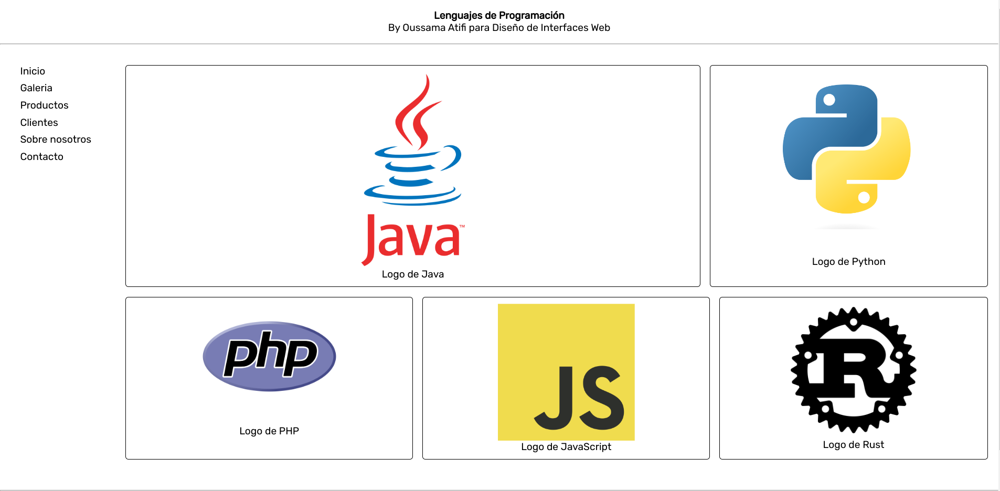

# Maquetación con GRID

## Descripción 📚

Galeria de lenguajes de programación maquetada unicamente con **grid**

[Accede a la documentacion sobre grid.](https://developer.mozilla.org/es/docs/Web/CSS/grid)



---

## Contenido 📖

- Este repositorio incluye tanto el archivo HTML como el archivo CSS para proporcionar estilos, además de las imágenes esenciales para la galería.

---

## Clonar el repositorio

1. **Clona el Repositorio:**
   Abre tu terminal y ejecuta el siguiente comando para clonar el repositorio en tu máquina local:

   ```bash
   git clone https://github.com/OussamaAtifii/github-markdown-grid.git
   ```

2. **Accede al Directorio del Proyecto:**

   ```bash
   cd github-markdown-grid
   ```

3. **Abre el directorio con tu editor de texto favorito.**

---

## Construido con 🛠️

- Este proyecto ha sido desarrollado utilizando únicamente HTML y CSS.

---

## Versionado

Este proyecto sigue un sistema de versionado semántico. A continuación se detallan las versiones y los cambios asociados.

- **v1.0.0 (Ejemplo Inicial):**
  - Estructura básica implementada.
  - Estilos iniciales aplicados.
- **v1.1.0 (Característica Adicional):**

  - Agregada galeria con de lenguajes con sus imagenes específicas.
  - Agregada barra de navegación.

- **v1.1.1 (Corrección de Errores):**
  - Solucionado problema header con el fluid layout.
  - Pequeñas correcciones de estilo.

---

## Autores 🧑🏽‍🏫

Este proyecto fue desarrollado por:

- Oussama Atifi.
  - Desarrollador principal
  - Responsable de la arquitectura del proyecto
  - Contacto: oussamaati03@gmail.com

---

## Licencia ©️ ®️

- Maquetacion con Grid © 2024 by Oussama Atifi is licensed under CC BY-NC-ND 4.0
